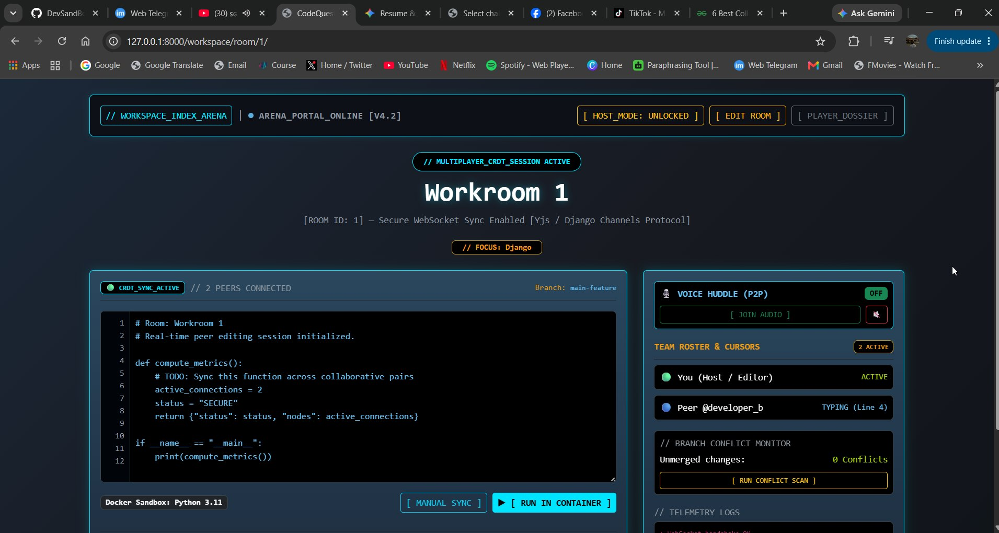

<div align="center">

# CodeQuest Arena

**An interactive, terminal-inspired multiplayer collaborative development platform featuring RPG progression, real-time developer rooms, and CTF security raid "boss battles**

[Live Demo](https://localhost:8000) · [Report Bug](https://github.com) · [Request Feature](https://github.com)


</div>

---

## Overview

**CodeQuest Arena** gamifies developer collaboration in a high-contrast cyberpunk environment. Powered by Django and WebSockets, it lets developers level up RPG-style avatar classes, co-author code in real-time workspaces, and team up to defeat CTF-inspired "security raid" boss battles by patching vulnerable codebases together.

---

## Interactive Workspace Preview

<div align="center">



*Real-time collaborative code editor with Yjs sync, git conflict gutters, and container execution console.*

</div>

---

## Key Features

* ** RPG Developer Progression: Choose and level up avatar classes (Frontend Wizards, Backend Architects, Security Ninjas) while earning XP, loot, and custom badges.
* ** CTF Security Raid "Boss Battles": Team up in live collaborative rooms to audit, debug, and patch intentionally vulnerable codebases before time runs out.
* ** Real-Time CRDT Code Rooms: Multi-peer concurrent code authoring, shared buffers, and cursor tracking powered by Yjs and Django Channels WebSockets.
* ** Ephemeral Container Execution: Spin up and run code snippets inside isolated Python 3.11 Docker runtime environments directly from the browser dashboard.
* **Cyberpunk Terminal Aesthetics:** High-contrast monospace dark-mode UI with live system telemetry logs and custom glow utilities.

---

## Tech Stack

* **Backend:** Python, Django, Django Channels, WebSockets (ASGI)
* **Real-Time Engine:** Yjs (CRDT Protocol)
* **Frontend:** HTML, Custom CSS Glow & Keyframe Utilities 
* **Sandboxing & Voice:** Docker Sandbox (Python 3.11 runtime), WebRTC P2P Audio API

---

## Setup & Installation

You can run the provided example project on your local machine by following the steps outlined below.

### 1. Virtual Environment Setup
Create a new virtual environment:
```bash
$ python3 -m venv venv 
# or for Windows:
$ py -m venv venv
```

## Activate the virtual environment:
```bash
$ source venv/bin/activate 
# or for Windows:
$ venv\Scripts\activate
```

### 2. Install Dependencies
Install the required dependencies for this project:
```bash
(venv) $ python -m pip install -r requirements.txt
```

### 3. Database Migrations
Make and apply migrations to build your local database:
```bash
(venv) $ python manage.py makemigrations
(venv) $ python manage.py migrate
```
### 4. Run the Development Server
Start the Django development server:
```bash
(venv) $ python manage.py runserver
```
Navigate to http://localhost:8000/ or http://localhost:8000/projects to see your workspace arena in action!

---

## Project Structure

```plaintext
CodeQuestArena/
├── pages/                      # Indexs views and page modules
├── personal_portfolio/         # Main Django project settings & configuration
├── projects/                   # Core project and CTF app
├── static/                     # CSS stylesheets, JavaScript, and static assets
├── templates/                  # HTML templates
├── uploads/project_images/     # Project image uploads and showcase assets
├── venv/                       # Python virtual environment
├── workspace/                  # Arena workspace app (CRDTs, channels, routing)
├── db.sqlite3                  # SQLite database file
├── manage.py                   # Django management utility
├── README.md                   # Project documentation
└── requirements.txt            # Python dependencies
```

---

